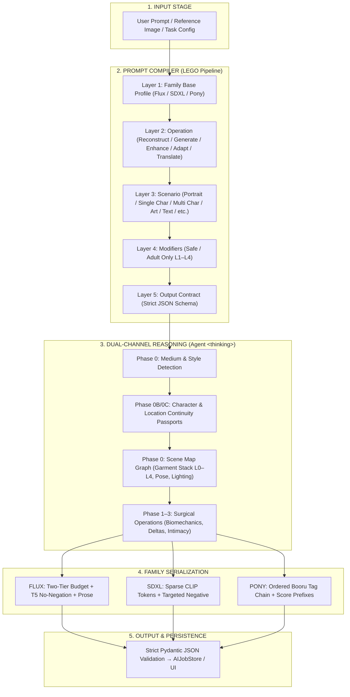
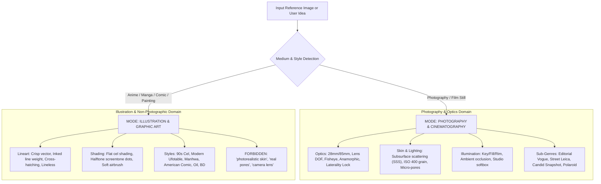
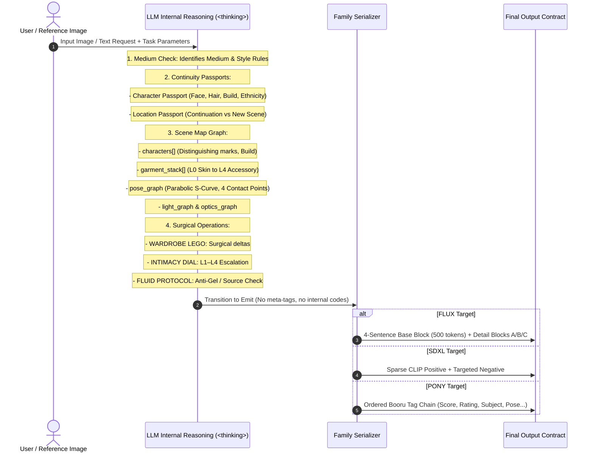
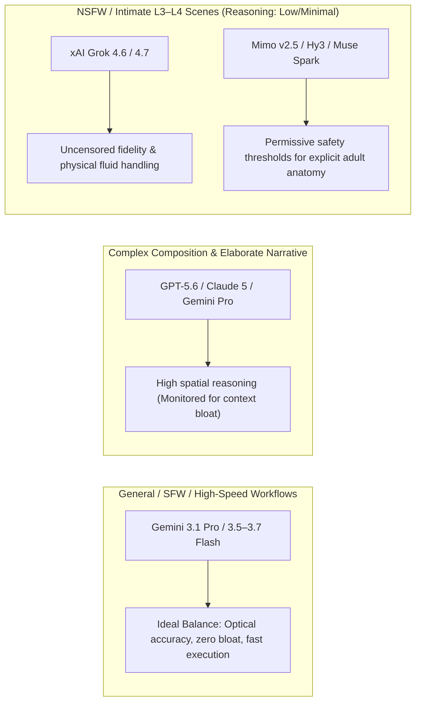

# CMV Prompt Engineering & AI Agent Architecture Specification

> **Status:** Canonical Master Reference Specification  
> **Target Execution Layer:** Frontier CLI Agents (OpenCode, Claude Code, Antigravity) & Direct API Adapters  
> **Active AI Ecosystem (2026):** Google Gemini 3.x, xAI Grok 4.x, OpenAI GPT-5.x, Anthropic Claude 4/5, Mimo v2.5, Hy3, Muse Spark, DeepSeek V3/R1/V4, Qwen 3  
> **Core Principle:** Modular LEGO-Layer Compilation (`PromptCompiler`) with Zero-Oversimplification & Deterministic Serialization

---

## 1. Executive Summary & Core Philosophy

This document defines the comprehensive prompt compilation, composition, and AI agent execution architecture for the **ComfyUI Meta Viewer (CMV)** ecosystem.

The system is engineered specifically for **frontier-class reasoning and multimodal AI models** (Google Gemini 3.1 Pro / 3.5–3.7 Flash, xAI Grok 4.6, OpenAI GPT-5.6, Anthropic Claude 4/5, Mimo v2.5, Hy3, Muse Spark) executed via isolated CLI agent hosts or direct API adapters. It operates without legacy compromises, unlocking:

1. **Dual-Channel Reasoning:** Deep multi-stage internal planning in `<thinking>` isolated from clean, single-prompt serialization.
2. **Deterministic LEGO Modularity:** 5-layer compilation pipeline (`FamilyBase` → `Operations` → `Scenarios` → `Modifiers` → `OutputContract`).
3. **Session & Series Continuity:** Grounded **Character Passports (0B)** and **Location Passports (0C)** with phantom reflection guards.
4. **Physical & Optical Truth:** Complete optical geometry, real lens physics, 4-point biomechanics, fabric tension, and subsurface scattering (SSS).
5. **Target-Family Fidelity:** Dedicated translation paradigms for Flux (T5-XXL No-Negation + Two-Tier Budget), SDXL (High Semantic CLIP Density + Targeted Negative), and Pony (Ordered Danbooru Chains + Score Hierarchy).

---

## 2. End-to-End Architecture & Data Flow

---

## 3. Modular Block Matrix (LEGO Architecture)

```mermaid
classDiagram
    class InstructionBundle {
        +FamilyProfile family_base
        +OperationManifest operation
        +ScenarioManifest scenario
        +ModifierManifest modifier
        +OutputContract contract
        +render() String
    }

    class FamilyBase {
        <<Layer 1>>
        +flux_base: T5 No-Negation, 4-sentence Base, Detail Blocks A/B/C
        +sdxl_base: Sparse CLIP, High density, Targeted negative
        +pony_base: Ordered tag chain, Booru taxonomy, Quality prefixes
    }

    class Operations {
        <<Layer 2>>
        +reconstruct: Graph Scene Map, Zero-hallucination, Passports 0B/0C
        +generate: Creative aesthetic expansion, Intent preservation
        +enhance: Surgical editing, Wishes delta, Core preservation
        +adapt: Syntax translation between model families
        +translate: Multi-lingual to English translation
    }

    class Scenarios {
        <<Layer 3>>
        +single_character: 4-Point Pose (Parabolic S-Curve), Fabric tension, 1:1 Male Lock
        +portrait: Expression micro-mechanics, SSS blush anti-paint, 9 Ethnicities
        +multi_character: Spatial anchors (Left/Right), Anti-cloning (2-5 vs 6+ crowd)
        +illustration_art: 90s Cel Anime, Modern Ufotable, Manga screentone, Western comic, Oil
        +graphic_design_text: Two-Zone Split, Ban //|_#, Casing lock, Body Protection
        +product_object: Scale anchoring, 6-Phone allowlist, Commercial studio light
        +architecture_interior: Depth planes, Material physics, Occlusion lighting
        +landscape_environment: 3-Tier Geolocation, Atmospheric layers, Horizon optics
    }

    class Modifiers {
        <<Layer 4>>
        +safe: SFW boundaries, Non-revealing drape, Rating safe
        +adult_only: Intimacy Dial L1-L4, Anti-Gel fluids, Controlled semen, Exact anatomy
    }

    class OutputContract {
        <<Layer 5>>
        +prompt_result: Strict JSON (positive_prompt, negative_prompt)
    }

    InstructionBundle *-- FamilyBase
    InstructionBundle *-- Operations
    InstructionBundle *-- Scenarios
    InstructionBundle *-- Modifiers
    InstructionBundle *-- OutputContract
```

---

## 4. Medium & Style Engine (Medium Separation Guardrail)

To prevent the "uncanny valley" and style contamination (e.g. forcing photographic skin pores or grain onto 2D anime or comic art), the agent enforces the **Medium Separation Protocol**:

### 4.1. Medium Taxonomy & Multi-Family Synonyms

| Category | Medium / Sub-genre | Key Technical Descriptors | Target Family Synonyms (Pony / Flux) |
| :--- | :--- | :--- | :--- |
| **Anime & Manga** | **90s Retro Cel** | Hand-painted cel, soft chromatic bloom, warm filmic color, watercolor backgrounds | `retro artstyle, 1990s (style), cel anime` / *"vintage hand-painted 90s anime cel"* |
| | **Modern High-End Digital** | Dynamic line weight, digital compositing, volumetric particle bloom, rich gradients | `modern anime, digital illustration, ufotable (style)` / *"crisp vector lineart with digital lighting"* |
| | **Painterly / Ghibli** | Gouache/watercolor textures, soft edge falloff, storybook warmth | `ghibli (style), watercolor (medium), traditional media` / *"storybook gouache painterly background"* |
| | **Action / Trigger** | Angular contours, forced perspective distortion, kinetic smears | `trigger (style), dynamic angle, stylized` / *"bold dynamic lines with extreme foreshortening"* |
| | **B&W Manga** | Crisp black ink lineart, halftone screentone dots, cross-hatching, speed lines | `monochrome, screentone, manga, lineart` / *"black and white manga panel with fine screentone"* |
| | **Korean Webtoon / Manhwa** | Clean digital lines, cell gradients, glowing eyes/magic, airbrush polish | `manhwa, webtoon, digital drawing` / *"high-polish digital webtoon aesthetic"* |
| **Comics** | **American Golden/Silver Age** | Heavy inking, Ben-Day dots, 4-color print offset, aged paper texture | `comic, american comic, vintage comic` / *"vintage comic book panel with visible Ben-Day dots"* |
| | **Modern Inked Noir** | Heavy black pooling, high contrast, stark shadows, gritty texture | `ink (medium), high contrast, noir` / *"stark black ink shadows and high-contrast comic inking"* |
| | **Franco-Belgian (Ligne Claire)** | Uniform clean line weight, zero hatching, flat color planes, architectural precision | `ligne claire, comic, clean line` / *"clear line French comic style with flat colors"* |
| **Traditional Art**| **Dark Fantasy Oil Painting** | Impasto brushstrokes, chiaroscuro lighting, canvas texture, varnish patina | `oil painting (medium), traditional media, painterly` / *"classical oil on canvas with heavy impasto strokes"* |
| | **Watercolor & Wash** | Wet-on-wet pigment bleeding, paper grain, translucent washes | `watercolor (medium), traditional media` / *"delicate translucent watercolor wash with organic bleeds"* |
| | **Concept Art (Digital Matte)** | Textured brushes, focal contrast, atmospheric haze, environmental scale | `concept art, digital painting, artstation` / *"cinematic matte painting with focused digital detail"* |
| **Realism** | **Editorial Fashion** | High-key studio lighting, octabox soft fill, Hasselblad clarity, clean backdrop | `studio lighting, professional photography, fashion` / *"editorial studio fashion photography on medium format"* |
| | **Street / Documentary** | 35mm candid, spontaneous moment, natural ambient light, Tri-X grain | `street photography, candid, photo` / *"documentary 35mm street photography with natural light"* |
| | **Cinematic Anamorphic** | 2.39:1 widescreen, horizontal optical flare, oval bokeh, teal-orange grade | `cinematic, film still, movie still` / *"cinematic anamorphic film frame with horizontal optical flares"* |
| | **Vintage Analog / Polaroid** | Lifted shadows, dye shift, white polaroid border, light leaks | `vintage photo, polaroid, film grain` / *"authentic vintage Polaroid with faded chemical color shift"* |

---

## 5. Dual-Channel Reasoning & Thinking Protocol

---

## 6. Biomechanics, Composition & Optics Protocols

### 6.1. 4-Point Pose Deconstruction
1. **Fluid Spine Geometry (Anti-90° Fold):** Forbid `"sharp 90-degree waist bend"`. Mandate `"smooth parabolic spine arch"` and `"graceful fluid S-curve"`.
2. **Physical Contact & Weight Distribution:** Explicitly anchor palms, soles, leaning hips, and seat contact (`"both palms pressed flat against the dark timber table, supporting forward leaning weight"`).
3. **Limb Articulation & Angles:** Explicit knee flexion, elbow angles, and stance balance.
4. **Head / Gaze Offset:** Decouple head turn from chest orientation (`"head turned ~15° over the shoulder, chin tucked, gaze slightly averted"`).

### 6.2. Fabric Physics & Anatomical Embossing
- **Zero Detached Overlays:** Anatomy must never appear as stickers or floating graphics.
- **Physical Fabric Tension:** Contours expressed through cloth stretch, gathering, and seam tension (`"subtle fabric tension stretching over natural bust contours, organic cloth deformation"`).
- **Sheer Translucency Bleed:** Underlying tones bleed through fabric weave via realistic optical translucency.

### 6.3. Two-Zone Typography Protocol
- **In-Scene Text:** Real physical inscriptions (t-shirt prints, store signs, labels) transcribed verbatim with casing and font hints.
- **Graphic Design Overlays:** Brand logos, poster banners, platform badges rendered strictly on user request.
- **Flux/Krea Syntax Constraints:**
  - Strict ban on `//`, `|`, `_`, `#` inside quoted text strings.
  - Casing Lock: `strictly in ALL CAPS`, `strictly in lowercase`, or `Title Case`.
  - Body Protection Guardrail: `"rendered strictly on the background, completely clear of the character's face and body"`.
- **T5-XXL No-Negation Rule:** Absence of technical garbage (watermarks, player buttons, UI subtitles) is achieved by **complete silence**, never by negative phrases.

### 6.4. Multi-Character & Anti-Cloning Protocol
- **Small Group (2–5 Characters):** Enumerate each person in a distinct, self-contained spatial block (`"On the left, [A]... On the right, [B]..."`). Lock distinct ethnicity, facial structure, build, and outfit.
- **Large Crowd (6+ Characters):** Group diversity description + depth planes (`"front row / middle / back"`), count anchors, forbidding face duplication.
- **Twins Exception:** Cloning allowed only when `identical twins` is explicitly verified in the Scene Map.

---

## 7. Adult / NSFW & Intimacy Protocols (`adult_only.md`)

### 7.1. Intimacy Dial (L1–L4)
- **L1 — Suggestive:** Alluring pose, micro-cuts, sheer accents, zero explicit nudity.
- **L2 — Revealed (Erotic):** Full/partial tasteful nudity (breasts, buttocks, torso) without explicit acts.
- **L3 — Intimate:** Solo or partner arousal, explicit anatomical precision (vulva, labia, erect nipples, shaft), optical light sheens.
- **L4 — Explicit:** Penetrative mechanics, climax physiology, multi-partner geometry described through physics and bodily reactions rather than vulgar shock slang.

### 7.2. Moisture & Fluid Protocol (Anti-Gel & Anti-Bukkake)
- **Source Rule:** Never invent moisture if the reference or prompt is dry.
- **Anti-Gel Rendering:** Fluids rendered as **thin, translucent sheens, surface light highlights, and micro-dewdrops**. Strict ban on thick viscous opaque gels, glue-like slabs, or heavy clay coats.
- **Controlled Ejaculate:** Pearlescent thin strands and scattered micro-droplets catching the light, forbidding massive opaque pools.

### 7.3. Male Wardrobe Lock (1:1 Protection)
- Exposure, sheerification, and sexualized cuts apply **exclusively to female-presenting characters** by default.
- Male characters remain 1:1 clothed as in reference unless male nudity is explicitly requested.

---

## 8. Implementation Matrix & File Map

| Layer | Component File | Key Content & Responsibility |
| :--- | :--- | :--- |
| **Layer 1: Profiles** | `app/ai/prompting/content/profiles/flux/base.md` | T5-XXL No-Negation, Two-Tier Budget (Base + Details A/B/C), Optical Laterality Lock |
| | `app/ai/prompting/content/profiles/sdxl/base.md` | "Analyze Richly, Serialize Sparsely", CLIP Semantic Ordering, Targeted Negative |
| | `app/ai/prompting/content/profiles/pony/base.md` | "Analyze Richly, Serialize as Tags", Ordered Booru Chain, Score/Source/Rating Prefix |
| **Layer 2: Operations** | `app/ai/prompting/content/operations/reconstruct.md`| Graph Scene Map, Zero-Hallucination, Passports 0B/0C |
| | `app/ai/prompting/content/operations/generate.md` | Creative aesthetic expansion, Intent preservation |
| | `app/ai/prompting/content/operations/enhance.md` | Surgical Wishes delta, Core preservation |
| | `app/ai/prompting/content/operations/adapt.md` | Cross-family syntax and token translation |
| | `app/ai/prompting/content/operations/translate.md`| Multi-lingual to English preservation |
| **Layer 3: Scenarios** | `app/ai/prompting/content/scenarios/single_character.md` | 4-Point Pose, Parabolic S-Curve, Fabric Tension, 1:1 Male Lock |
| | `app/ai/prompting/content/scenarios/portrait.md` | Expression micro-mechanics, SSS Blush Anti-Paint, 9 Ethnicities |
| | `app/ai/prompting/content/scenarios/multi_character.md` | Spatial Anchors, 2–5 Anti-Cloning, Crowd Layers, Twins Exception |
| | `app/ai/prompting/content/scenarios/illustration_art.md` | Complete Style & Medium Engine (Anime Cel, Manga, Comic, Oil, Webtoon) |
| | `app/ai/prompting/content/scenarios/graphic_design_text.md` | Two-Zone Text Split, Ban //|_#, Casing Lock, Canvas Positioning |
| | `app/ai/prompting/content/scenarios/product_object.md` | Scale Anchoring, 6-Phone Allowlist, Camera Pointers, Studio Light |
| | `app/ai/prompting/content/scenarios/architecture_interior.md` | Depth Planes, Material Physics, Ambient Occlusion |
| | `app/ai/prompting/content/scenarios/landscape_environment.md` | 3-Tier Geolocation, Atmospheric Haze, Horizon Optics |
| **Layer 4: Modifiers** | `app/ai/prompting/content/modifiers/safe.md` | SFW boundaries, Rating Safe |
| | `app/ai/prompting/content/modifiers/adult_only.md` | Intimacy Dial L1–L4, Anti-Gel Fluid Protocol, Cross-Family NSFW Syntax |
| **Layer 5: Contract** | `app/ai/prompting/content/output_contracts/prompt_result.md` | Strict Pydantic JSON Contract (`positive_prompt`, `negative_prompt`) |

---

## 9. Model Selection, Provider Behaviors & Runtime Execution Guidelines

Practical experience and empirical benchmarking have revealed distinct behavioral patterns across modern LLM providers. Selecting the right model for a specific task guarantees optimal fidelity while avoiding prompt bloat and safety refusals.

### 9.1. Detailed Provider Profile & Behavioral Analysis

#### 1. Google Gemini Provider (`Gemini 3.1 Pro`, `Gemini 3.5 / 3.6 / 3.7 Flash`, `Gemini 3 Deep Think`)
- **Primary Verdict:** **The Natural Favorite & Production Benchmark.**
- **Strengths:** 
  - Exceptional grasp of spatial composition, lighting physics, material textures, and camera optics without hallucinating extraneous elements.
  - Generates concise, high-density prompts strictly within the requested token budget without conversational bloat.
  - Flash models (3.5–3.7) provide near-instant latency with frontier-level instruction following.
- **Safety / NSFW Profile:** Handles mild-to-moderate intimacy (L1 Suggestive, L2 Revealed) gracefully. For deeply erotic or explicit anatomical acts (L3–L4), corporate safety filters can trigger refusals.
- **Best Use Cases:** Photography, Portraits, Architecture, Product Photography, SFW/Erotic Art, Real-time UI workflows.

#### 2. OpenAI Provider (`GPT-5.6 Sol / Terra / Luna`, `GPT-5`, `o3` Series)
- **Primary Verdict:** **Powerful Composition with a Tendency Toward Context Bloat.**
- **Strengths:** Excellent multi-subject relationship understanding, rich vocabulary, and subtle artistic nuance.
- **Weaknesses:** Strong tendency to **overcomplicate and bloat the prompt** with unnecessary narrative backstory, verbose adjectives, and redundant qualifiers if not strictly constrained by the CMV runtime.
- **Best Use Cases:** Complex multi-character storytelling, intricate historical fantasy setups, and complex concept ideation where length is secondary to depth.

#### 3. Uncensored & Permissive NSFW Champions (`Grok 4.6 / 4.7`, `Mimo v2.5`, `Hy3`, `Muse Spark`)
- **Primary Verdict:** **Top Tier for Uncensored, Explicit & Anatomically Accurate NSFW Execution.**
- **Key Models:**
  - **xAI Grok (`Grok 4.6 / 4.7`):** High compositional and linguistic competence with minimal safety interference; renders explicit intimacy (L3 Intimate, L4 Explicit) and physical fluid dynamics without moralizing refusals.
  - **Mimo v2.5:** Highly reliable for adult prompts, following complex prompt structures without triggering puritanical blockers.
  - **Hy3 (Hunyuan 3):** Excellent anatomical and physical understanding with relaxed content gating.
  - **Muse Spark (MiniMax):** Outstanding aesthetic and erotic nuance with high tolerance for sensitive themes.
- **Best Use Cases:** Adult / NSFW Generation, Intimate Portraits, Fetish/Erotic Aesthetics, Dark Fantasy / Gritty Themes.

#### 4. Strictly Censored Chinese Models (`DeepSeek-V3 / R1 / V4`, `Qwen 3 / Qwen 2.5`)
- **Important Censorship Notice:** Despite their high general reasoning and coding power, models from the **DeepSeek** and **Qwen** families feature **extremely strict, hardcoded internal censorship** regarding explicit adult/erotic content and anatomical terms. They are **not recommended** for NSFW / Intimacy Dial (L3–L4) scenarios.
- **Best Use Cases:** SFW General Generation, Multi-Lingual Translation (Russian/Chinese to English), Code and Structured JSON analysis.

#### 5. Code-Specialized & Non-Vision LLMs
- **Primary Verdict:** **High Error Rate; Not Recommended as Primary Prompt Generators.**
- **Weaknesses:** Models tuned strictly for code or lacking descriptive visual training frequently make fundamental spatial and logical errors (confusing left/right laterality, creating physical contradictions like dry wet-paint, or inventing impossible anatomy).
- **Runtime Scaffolding Role:** The CMV Prompt Runtime enforces strict JSON formatting and validation, but **cannot magically compensate** for a model's intrinsic lack of visual composition intuition and common-sense spatial reasoning.

---

### 9.2. Reasoning Effort Strategy for NSFW & Censorship Mitigation

Reasoning models (e.g. models with `<thinking>` channels) frequently trigger safety blockers during their extensive internal reasoning tokens when processing adult keywords.

> [!TIP]
> **NSFW Reasoning Configuration:**
> - For NSFW / Adult scenarios (L2–L4), set **Reasoning Effort to `low` or `minimal`** (or disable extended thinking where supported).
> - **Mechanism:** Minimizing reasoning tokens reduces the surface area for intermediate safety classifier triggers while allowing the model to directly emit the structured prompt via the target family serializer.

---

### 9.3. Recommended Production Routing Matrix

| Task / Scenario | 1st Choice (Primary) | 2nd Choice (Alternative) | NSFW / Uncensored Choice |
| :--- | :--- | :--- | :--- |
| **Photographic Realism & Portraits** | `Gemini 3.7 Flash` | `Gemini 3.1 Pro` | `Grok 4.6` |
| **Product & Commercial Stills** | `Gemini 3.7 Flash` | `GPT-5.6 Terra` | `Mimo v2.5` |
| **Architecture & Landscapes** | `Gemini 3.5/3.7 Flash` | `Claude 4 / 5 Sonnet` | `Hy3` |
| **Illustration, Anime & Comics** | `Gemini 3.7 Flash` | `Mimo v2.5` | `Muse Spark` |
| **Complex Multi-Character (2–5)** | `Gemini 3.1 Pro` | `GPT-5.6 Sol` | `Grok 4.6` |
| **NSFW: L1 Suggestive / L2 Erotic** | `Gemini 3.7 Flash` | `Mimo v2.5` | `Grok 4.6` |
| **NSFW: L3 Intimate / L4 Explicit** *(Effort: Low/Minimal)* | `Grok 4.6 / 4.7` | `Mimo v2.5` | `Hy3 / Muse Spark` |
| **Multi-Lingual Translation** | `Gemini 3.7 Flash` | `Qwen 3` | `DeepSeek-V3` |
