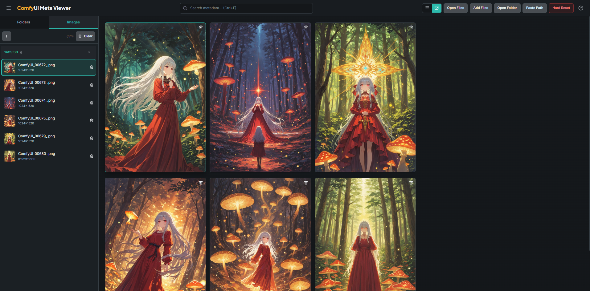
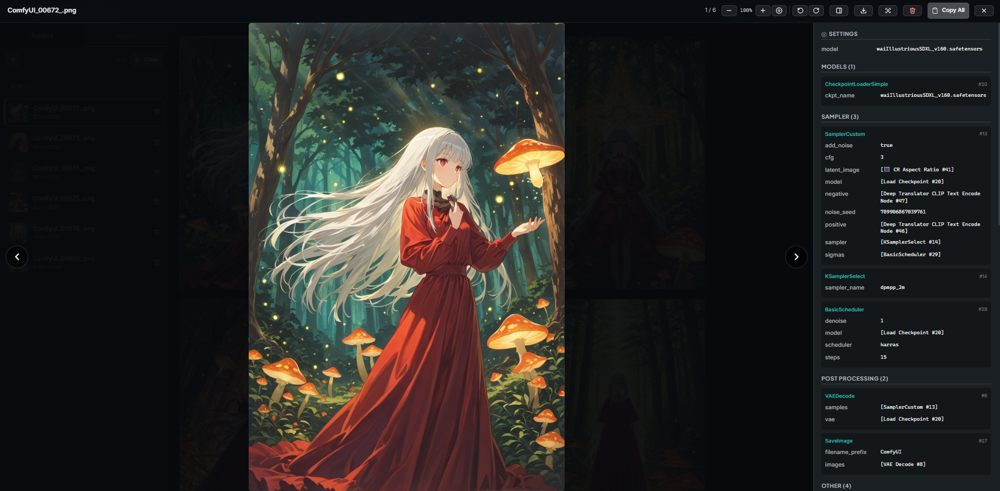

<p align="center">
  
</p>

<p align="center">
  <strong>Metadata viewer & manager for ComfyUI generated images</strong>
</p>

<p align="center">
  
  
  
  
  
</p>

<p align="center">
  <a href="#features">Features</a> &bull;
  <a href="#quick-start">Quick Start</a> &bull;
  <a href="#screenshots">Screenshots</a> &bull;
  <a href="#documentation">Documentation</a> &bull;
  <a href="#api-reference">API</a>
</p>

---

## Overview

ComfyUI Meta Viewer is a local web application for viewing, organizing, and analyzing metadata from images generated by [ComfyUI](https://github.com/comfyanonymous/ComfyUI). It extracts prompts, workflow graphs, generation parameters, and EXIF data — all in a clean, modern interface.

### Key capabilities

- **Metadata extraction** from PNG chunks, EXIF, and ComfyUI workflow JSON
- **Interactive workflow graph** visualization with color-coded nodes
- **Folder scanning** in-place (no file copying)
- **Lazy upload indexing** — a quick PNG/JPEG/WebP marker probe categorizes imports; full metadata is parsed when opened
- **Object cutout** — automatic background removal with transparent PNG export
- **SQLite persistence** — all data survives restarts
- **Keyboard-first** workflow with 14 shortcuts

---

## Features

<table>
  <tr>
    <td>
      
      <strong>Metadata Extraction</strong><br>
      <sub>Prompts, settings, models, LoRA, EXIF</sub>
    </td>
    <td>
      
      <strong>Workflow Visualization</strong><br>
      <sub>Interactive SVG graph of ComfyUI nodes</sub>
    </td>
    <td>
      
      <strong>Folder Scanning</strong><br>
      <sub>In-place scan with incremental caching</sub>
    </td>
  </tr>
  <tr>
    <td>
      
      <strong>Gallery & Lightbox</strong><br>
      <sub>Masonry layout, cursor zoom, click-drag pan, rotate, touch swipe</sub>
    </td>
    <td>
      
      <strong>Fuzzy Search</strong><br>
      <sub>Search by filename, prompt, model, sampler</sub>
    </td>
    <td>
      
      <strong>Object Cutout</strong><br>
      <sub>Auto background removal, transparent PNG</sub>
    </td>
  </tr>
  <tr>
    <td>
      
      <strong>Keyboard Shortcuts</strong><br>
      <sub>14 shortcuts + Help Center</sub>
    </td>
    <td>
      
      <strong>Local Folder Index</strong><br>
      <sub>Single-user library, no sessions</sub>
    </td>
    <td>
      
      <strong>Diagnostics</strong><br>
      <sub>System stats in Help Center</sub>
    </td>
  </tr>
</table>

---

## Screenshots

### Interface

<table>
  <tr>
    <td width="50%">
      <strong>Gallery view</strong><br>
      <sub>Masonry grid layout with thumbnails and quick metadata preview on hover.</sub>
    </td>
    <td width="50%">
      <strong>Lightbox with metadata</strong><br>
      <sub>Prompts, generation parameters, and model info at a glance.</sub>
    </td>
  </tr>
  <tr>
    <td width="50%">
      
    </td>
    <td width="50%">
      
    </td>
  </tr>
</table>

### Motion Demos

<table>
  <tr>
    <td width="50%">
      <strong>Gallery browsing</strong><br>
      <sub>Smooth scrolling through large galleries with lazy-loaded thumbnails.</sub>
    </td>
    <td width="50%">
      <strong>Workflow inspection</strong><br>
      <sub>Zoom, pan, and inspect individual ComfyUI node parameters.</sub>
    </td>
  </tr>
  <tr>
    <td width="50%">
      
    </td>
    <td width="50%">
      
    </td>
  </tr>
</table>

---

## Quick Start

### Prerequisites

- **Python 3.10+**
- **Poetry** (for dependency management)

### Installation

```bash
# Clone the repository
git clone https://github.com/Lotargo/ComfyUI-Meta-Viewer.git
cd ComfyUI-Meta-Viewer

# Install dependencies
poetry install --no-root
```

### Running

```bash
# Start the server (opens browser automatically)
poetry run python -m app.main

# Or use the launcher script
# Windows:
start.bat
# Linux/macOS:
./start.sh
```

The app will be available at **http://localhost:7860**

### Usage

1. **Scan a folder** — drag a folder onto the window or use the scan input
2. **Browse images** — use the sidebar to navigate, click to view details
3. **View metadata** — Summary tab shows prompt + settings
4. **Explore workflow** — Workflow tab shows the ComfyUI node graph
5. **Search** — Ctrl+F to fuzzy search across all metadata
6. **Cutout** — Select an image and generate a transparent PNG

---

## Tech Stack

| Layer | Technology | Purpose |
|-------|-----------|---------|
| **Backend** | Python 3.10+ | Server logic |
| **HTTP** | Flask 3.1 | REST API + static files |
| **Database** | SQLite (WAL mode) | Metadata storage |
| **Validation** | Pydantic v2 | Request/response models |
| **Images** | Pillow 11.0 | Metadata extraction, thumbnails, cutout |
| **Frontend** | Vanilla JS (ES modules) | SPA interface |
| **CSS** | Custom Properties | Modular styling |
| **Search** | Fuse.js 7.0 | Fuzzy search (vendored in `app/static/js/vendor/`) |
| **Dependencies** | Poetry | Package management |

---

## Documentation

| Document | Description |
|----------|-------------|
| [Architecture](docs/architecture.md) | System overview, data flow, database schema |
| [API Reference](docs/api.md) | All 18 REST endpoints with examples |
| [Features](docs/features.md) | Detailed feature descriptions |
| [Configuration](docs/configuration.md) | Environment variables, paths, CLI flags |
| [Development](docs/development.md) | Guide for contributors |
| [JS Architecture](docs/js-architecture.md) | Frontend module structure |
| [CSS Architecture](docs/css-architecture.md) | Styling system and custom properties |

---

## API Reference

### Core Endpoints

| Method | Endpoint | Description |
|--------|----------|-------------|
| `POST` | `/api/scan` | Scan a folder for images |
| `POST` | `/api/upload` | Upload image files |
| `GET` | `/api/images` | List images (paginated) |
| `GET` | `/api/images/{id}` | Get image details + metadata |
| `DELETE` | `/api/images/{id}` | Delete an image |
| `GET` | `/api/thumbnail/{id}` | Get JPEG thumbnail |
| `GET` | `/api/original/{id}` | Get original image |
| `POST` | `/api/cutout/{id}` | Generate transparent cutout |
| `GET` | `/api/folders` | List scanned folders |
| `GET` | `/api/diagnostics` | System statistics |

Full API documentation: [docs/api.md](docs/api.md)

---

## Keyboard Shortcuts

| Key | Action |
|-----|--------|
| `←` `→` | Navigate images |
| `Enter` | Open lightbox |
| `Escape` | Close lightbox / panel |
| `Delete` | Delete image |
| `Ctrl+F` | Search |
| `G` | Toggle gallery/list |
| `?` | Help Center |
| `1` `2` `3` | Switch meta tabs |
| `D` | Toggle meta panel |
| `S` | Toggle sidebar |

Full shortcuts list: [docs/features.md#keyboard-shortcuts](docs/features.md#keyboard-shortcuts)

---

## Project Structure

```
comfy-meta-viewer/
├── app/
│   ├── main.py              # Flask routes (18 endpoints)
│   ├── database.py          # SQLite operations
│   ├── extractor.py         # Metadata parsing
│   ├── cutout.py            # Background removal
│   ├── schemas.py           # Pydantic models
│   ├── static/
│   │   ├── css/             # Modular CSS
│   │   └── js/              # ES modules
│   └── templates/
│       └── index.html       # SPA entry
├── docs/                    # Documentation
├── dev_docs/                # Internal dev docs
├── cache/                   # Thumbnails + cutouts
├── pyproject.toml           # Poetry config
├── start.bat                # Windows launcher
└── start.sh                 # Linux launcher
```

Full structure: [docs/architecture.md#directory-structure](docs/architecture.md#directory-structure)

---

## Configuration

| Variable | Default | Description |
|----------|---------|-------------|
| `COMFY_META_PORT` | `7860` | Server port |
| `COMFY_META_UPLOAD` | `.comfy_meta_uploads` | Upload + database directory |

Full configuration: [docs/configuration.md](docs/configuration.md)

---

## Contributing

See [Development Guide](docs/development.md) for setup instructions and code style.

### Adding a new API endpoint

1. Add route in `app/main.py`
2. Add Pydantic model in `app/schemas.py`
3. Add client function in `app/static/js/api.js`
4. Document in `docs/api.md`

### Adding a new frontend feature

1. Create module in `app/static/js/features/`
2. Create styles in `app/static/css/features/`
3. Import in `app.js`
4. Document in `docs/features.md`

---

## License

GNU Affero General Public License v3.0 only. See [LICENSE](LICENSE).

---

## Acknowledgments

- [ComfyUI](https://github.com/comfyanonymous/ComfyUI) — the image generation framework
- [Fuse.js](https://www.fusejs.io/) — fuzzy search library
- [Pydantic](https://docs.pydantic.dev/) — data validation
- [Flask](https://flask.palletsprojects.com/) — web framework
