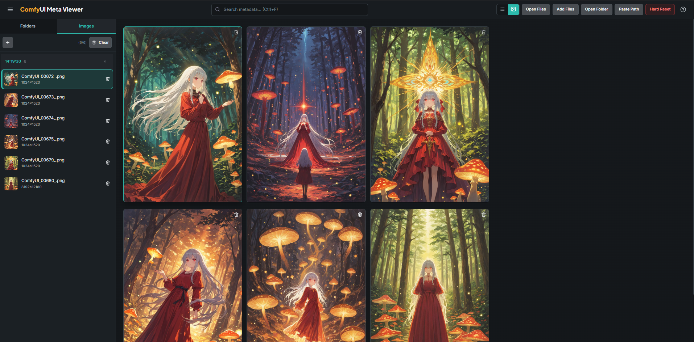
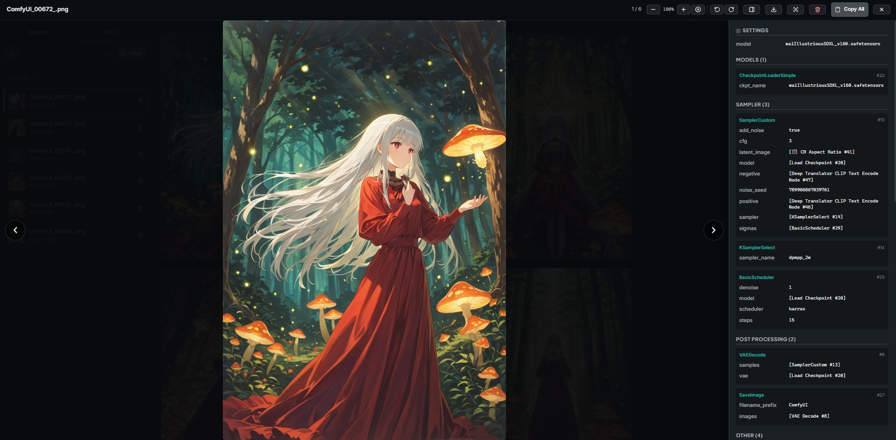

<p align="center">
  
</p>

<p align="center">
  <strong>Metadata viewer & manager for ComfyUI generated images</strong>
</p>

<p align="center">
  
  
  
  
  
  
</p>

<p align="center">
  <a href="#features">Features</a> &bull;
  <a href="#feature-status">Status</a> &bull;
  <a href="#quick-start">Quick Start</a> &bull;
  <a href="#screenshots">Screenshots</a> &bull;
  <a href="#documentation">Documentation</a> &bull;
  <a href="#api-reference">API</a>
</p>

---

## Overview

ComfyUI Meta Viewer is a local-first web application for viewing, organizing, and
analyzing images generated by [ComfyUI](https://github.com/comfyanonymous/ComfyUI).
Every generated file is treated as a carrier of reproducible intelligence: prompts,
sampler settings, models, LoRAs, and the complete node graph are extracted from PNG
text chunks, EXIF, and embedded ComfyUI workflow JSON - all in a fast, keyboard-driven
interface.

Under the surface it is more than a gallery: metadata stays attached to the workflow
that created it, the Media Library is a virtual database view over your real folders,
AI prompting is *compiled* from layered model-aware skills instead of one universal
system prompt, and the integrated ComfyUI runtime can turn an existing asset back into
a queueable workflow - everything runs locally with no cloud dependency.

### Key capabilities

- **Metadata extraction** from PNG chunks, EXIF, and ComfyUI workflow JSON
- **Interactive workflow graph** visualization with color-coded nodes
- **Live source monitoring** for local and desktop-synced cloud folders, with no file copying
- **Image and video uploads** - drop supported media into the app; images stay lazy while videos receive technical metadata and a poster frame when FFmpeg tools are available
- **Object cutout** - automatic background removal with transparent PNG export
- **SQLite persistence** - all data survives restarts
- **Media Library** - virtual albums, favorites, ratings, tags, notes, and bulk selection without moving source files
- **Unified image and video assets** - shared sources, albums, favorites, previews, and technical metadata
- **Unified media browsing** - folders, albums, the central gallery, and the Media sidebar can show images and videos together or filter either type independently
- **Create workspace** - manifest-driven image, reference, video, and two-stage workflow templates with dynamic local model selection *(partial - see [Feature Status](#feature-status))*
- **ComfyUI execution** - integrated runtime setup, dependency preflight, queue state, cancellation, result import, and workflow provenance
- **Remix drafts** - carry an asset prompt and lineage into a supported reference workflow without starting generation automatically *(scaffold - see [Feature Status](#feature-status))*
- **BYOK provider profiles** - OpenAI-compatible endpoints with OS-keyring or environment-variable credentials, plus detected OpenCode, Claude Code, and Antigravity CLI adapters
- **Model-aware prompt compiler** - layered family, operation, scenario, modifier, and output-contract instructions with strict structured results
- **Keyboard-first** workflow with 14 shortcuts

### Design decisions

- **Virtuality first** - albums, favorites, ratings, tags, and notes live in the
  database as a *view* over the real folders: nothing is moved, renamed, or copied.
  Even a factory reset rebuilds the index without touching a single source file.
- **In-place indexing** - sources are scanned in place with an incremental cache, and
  desktop-synced cloud folders can be watched continuously without duplicating data
  on disk.
- **Provenance as data** - the original ComfyUI workflow graph is preserved per asset,
  rendered as an interactive color-coded node graph, and available for re-import into
  the workflow editor.
- **Local & private** - runs on `localhost` with no cloud dependency; AI provider
  credentials are stored masked in the OS keyring or environment variables, and
  authenticated local CLIs (OpenCode, Claude Code, Antigravity) are discovered
  automatically.
- **Model-aware AI tooling** - prompting is compiled from layered family
  (FLUX / SDXL / Pony), operation, scenario, and modifier skills into strict structured
  output, guarded by deterministic intent judges and CLI-run benchmarks; the same
  engine powers AI prompt enhancement and vision reconstruction inside Create.
- **ComfyUI-native execution** - detects and can auto-start a local ComfyUI (including
  portable installs), queues generation, and imports results back with full provenance.
- **Unified media** - images and videos share one pipeline: uploads, previews (video
  poster frames need FFmpeg), a virtual library, and independent media-type filters.

---

## Feature Status

Not every planned surface is wired into the running product yet. This section
separates what works end-to-end today from what is laid out as infrastructure
(scaffold) but not yet usable from the UI.

**Implemented** - works from the UI today:

- **Core viewer** - gallery & lightbox, metadata tabs, folder scan + live source
  monitoring, fuzzy search, object cutout, image/video uploads.
- **Media Library** - albums, favorites, ratings, tags, notes, bulk selection,
  deletion to the system trash.
- **Unified image/video assets** - shared sources, albums, previews, and
  media-type filters (video previews require FFmpeg).
- **BYOK AI providers** - provider profiles with keyring/env credentials
  and local CLI discovery (OpenCode, Claude Code, Antigravity); the prompt
  compiler, intent/quality benchmarks, and smoke runners are functional via CLI.
- **ComfyUI runtime** - auto-detection/auto-start, queue, cancellation, result
  import, and workflow provenance.
- **Create - generation** - model download and workflow execution work for
  **5 of 8** bundled models (model_01-03, 07, 08).

**Scaffold / partial** - laid out, but not working end-to-end from the UI:

- **Create - model_04 / 05 / 06** - shown as selectable in the UI, but still
  calibration placeholders: resources can be downloaded, generation is blocked
  (no `workflow.json` / `bindings.json` yet).
- **Remix** - the lightbox action creates a draft and jumps to the Create page,
  but Create does not read `draft_id` from the URL, so the handoff is a dead end.
- **Advanced Workflow Editor + AI operations** (generate / translate / adapt /
  reconstruct / enhance) - the backend is real, but the editor page is only
  reachable at `/settings/comfyui` or `/editor/legacy` and is unlinked from the
  main navigation.
- **Social publishing** (VK / Telegram / Instagram) - provider cards render on
  the Integrations page, but publishing is unimplemented for all providers, and
  VK OAuth works only over port 80.

---

## Features

<table>
  <tr>
    <td>
      
      <strong>Metadata Extraction</strong><br>
      <sub>Prompts, settings, models, LoRA, EXIF</sub>
    </td>
    <td>
      
      <strong>Workflow Visualization</strong><br>
      <sub>Interactive SVG graph of ComfyUI nodes</sub>
    </td>
    <td>
      
      <strong>Folder Scanning</strong><br>
      <sub>In-place scan with incremental caching</sub>
    </td>
  </tr>
  <tr>
    <td>
      
      <strong>Gallery & Lightbox</strong><br>
      <sub>Cached 4K previews, cursor zoom, click-drag pan, and full-original access</sub>
    </td>
    <td>
      
      <strong>Fuzzy Search</strong><br>
      <sub>Search by filename, prompt, model, sampler</sub>
    </td>
    <td>
      
      <strong>Object Cutout</strong><br>
      <sub>Auto background removal, transparent PNG</sub>
    </td>
  </tr>
  <tr>
    <td>
      
      <strong>Keyboard Shortcuts</strong><br>
      <sub>14 shortcuts + Help Center</sub>
    </td>
    <td>
      
      <strong>Live Source Index</strong><br>
      <sub>Watcher + periodic reconciliation</sub>
    </td>
    <td>
      
      <strong>Diagnostics</strong><br>
      <sub>System stats in Help Center</sub>
    </td>
  </tr>
</table>

---

## Screenshots

### Interface

<table>
  <tr>
    <td width="50%">
      <strong>Gallery view</strong><br>
      <sub>Masonry grid layout with thumbnails and quick metadata preview on hover.</sub>
    </td>
    <td width="50%">
      <strong>Lightbox with metadata</strong><br>
      <sub>Prompts, generation parameters, and model info at a glance.</sub>
    </td>
  </tr>
  <tr>
    <td width="50%">
      
    </td>
    <td width="50%">
      
    </td>
  </tr>
</table>

### Motion Demos

<table>
  <tr>
    <td width="50%">
      <strong>Gallery browsing</strong><br>
      <sub>Smooth scrolling through large galleries with lazy-loaded thumbnails.</sub>
    </td>
    <td width="50%">
      <strong>Workflow inspection</strong><br>
      <sub>Zoom, pan, and inspect individual ComfyUI node parameters.</sub>
    </td>
  </tr>
  <tr>
    <td width="50%">
      
    </td>
    <td width="50%">
      
    </td>
  </tr>
</table>

---

## Quick Start

### Prerequisites

- **Python 3.10+**
- **Poetry** (for dependency management)

### Installation

```bash
# Clone the repository
git clone https://github.com/Lotargo/ComfyUI-Meta-Viewer.git
cd ComfyUI-Meta-Viewer

# Install dependencies
poetry install --no-root
```

### Running

```bash
# Start the server (opens browser automatically)
poetry run python -m app.main

# Or use the launcher script
# Windows:
start.bat
# Linux/macOS:
chmod +x start.sh
./start.sh
```

The app will be available at **http://localhost:7860**

### Usage

1. **Connect a folder** - use Open Folder, then toggle monitoring or recursive subfolder scanning from the source card
2. **Browse media** - use the Media sidebar to show images, videos, or both; click an item to preview it
3. **View metadata** - Summary tab shows prompt + settings
4. **Explore workflow** - Workflow tab shows the ComfyUI node graph
5. **Search** - Ctrl+F to fuzzy search across all metadata
6. **Cutout** - Select an image and generate a transparent PNG
7. **Configure AI** - open the AI page, add an endpoint or import a detected local CLI, choose exact model IDs, and test text or image support
8. **Create** - choose Image, Reference, Video, or High detail; describe the result, select a local model, and press Create. Dependency checks run automatically, while technical controls stay under More settings (model_04-06 are still calibration placeholders and cannot generate)
9. **Remix** - available from the lightbox, but the draft->Create handoff is not wired yet; see [Feature Status](#feature-status)

---

## Known Limitations

- **Custom Nodes & Workflows**: Standard built-in workflow templates cover checkpoint-contained, Flux separate-components, Pony/SDXL GGUF, reference, and video pipelines. Highly customized third-party node workflows can be imported using the mapping wizard, but complex multi-pipeline graphs may require manual node binding or mapping adjustment.
- **Desktop Installers**: Standalone desktop installers (`.exe` / `.dmg` / `AppImage`), electron/tauri packaging, and auto-update are scheduled for Post-v1. Currently, the application runs as a local Python web application.
- **FFmpeg Dependency**: Basic image viewing, metadata extraction, and library management work out-of-the-box without extra tools. Video thumbnail preview and technical stream metadata extraction require `ffmpeg` / `ffprobe` binaries on your system `PATH`.
- **Platform Support**: Primary release platform is Windows; cross-platform validation is performed via GitHub Actions CI for Linux and macOS.

---

## Tech Stack

| Layer | Technology | Purpose |
|-------|-----------|---------|
| **Backend** | Python 3.10+ | Server logic |
| **HTTP** | Flask 3.1 | REST API + static files |
| **Database** | SQLite (WAL mode) | Metadata storage |
| **Validation** | Pydantic v2 | Request/response models |
| **Images** | Pillow 11.0 | Metadata extraction, thumbnails, cutout |
| **Monitoring** | Watchdog 6.0 | Cross-platform filesystem events |
| **Secrets** | Keyring 25.x | Windows Credential Manager, macOS Keychain, or Linux Secret Service |
| **Frontend** | Vanilla JS (ES modules) | SPA interface |
| **CSS** | Custom Properties | Modular styling |
| **Search** | Fuse.js 7.0 | Fuzzy search (vendored in `app/static/js/vendor/`) |
| **Tracing** | OpenTelemetry | Optional traces via OTLP exporter |
| **Tests** | pytest | Unit + integration suite (see `tests/`) |
| **Dependencies** | Poetry | Package management |

---

## Documentation

| Document | Description |
|----------|-------------|
| [Architecture](docs/core/architecture.md) | System overview, data flow, database schema |
| [API Reference](docs/core/api.md) | Detailed REST endpoints, behavior, examples, and legacy editor notes |
| [Interactive API](https://lotargo.github.io/ComfyUI-Meta-Viewer/api/) | Scalar portal backed directly by the public OpenAPI 3.1 contract |
| [Features](docs/core/features.md) | Detailed feature descriptions |
| [Configuration](docs/core/configuration.md) | Environment variables, paths, CLI flags |
| [Development](docs/dev/development.md) | Guide for contributors and public API synchronization rules |
| [JS Architecture](docs/dev/js-architecture.md) | Frontend module structure |
| [CSS Architecture](docs/dev/css-architecture.md) | Styling system and custom properties |
| [Prompt intent benchmarks](docs/ai/intent-benchmark.md) | Targeted raw-intent generation and model-judge evaluation |
| [OpenCode smoke testing](docs/ai/opencode-smoke-testing.md) | Managed CLI execution, profiles, scenarios, and reports |
| [AI prompt architecture](docs/ai/prompt-architecture.md) | Canonical profiles, compilation, execution routing, persistence, and skill export |
| [Legacy workflow editor notes](docs/core/api.md#comfyui-runtime-and-legacy-workflow-editor) | Retained `/api/editor/*` implementation reference, intentionally outside the public OpenAPI contract |
| [Roadmap](ROADMAP.md) | AI prompt compiler status, benchmark targets, and planned work |

---

## API Reference

CMV exposes a local REST API at `http://localhost:7860`. The machine-readable public contract is [`site/api/openapi.json`](site/api/openapi.json) and the interactive Scalar portal is available at [lotargo.github.io/ComfyUI-Meta-Viewer/api/](https://lotargo.github.io/ComfyUI-Meta-Viewer/api/).

The public contract covers every supported non-legacy `/api/*` route. The retained `/api/editor/*` workflow-editor surface is legacy/internal and is documented separately in `docs/core/api.md` rather than advertised as part of the public contract.

### Representative public endpoints

| Area | Method | Endpoint | Description |
|------|--------|----------|-------------|
| Sources | `POST` | `/api/scan` | Connect and index a source directory |
| Sources | `PATCH` | `/api/folders/{id}` | Enable/disable a source or change recursion |
| Sources | `POST` | `/api/folders/{id}/reconcile` | Queue a full source reconciliation |
| Media | `POST` | `/api/upload` | Upload image or video files |
| Media | `GET` | `/api/images` | List paginated image/video assets |
| Media | `GET` | `/api/assets/{id}` | Get unified asset details and separated metadata layers |
| Library | `GET` | `/api/library/assets` | Query the virtual library with filters |
| Library | `POST` | `/api/library/assets/bulk` | Apply bulk virtual-library operations |
| Preview | `GET` | `/api/preview/{id}` | Get or generate a bounded display preview |
| AI | `GET/POST` | `/api/ai/profiles` | Manage sanitized AI provider profiles |
| AI | `POST` | `/api/ai/generate` | Generate a durable prompt draft |
| AI | `POST` | `/api/ai/translate` | Translate prompt text, optionally through SSE |
| AI | `POST` | `/api/ai/adapt` | Adapt a prompt to a target model family |
| AI | `POST` | `/api/ai/enhance` | Enhance prompt composition and detail |
| AI | `POST` | `/api/ai/reconstruct/analyze` | Analyze an indexed image into a SceneSpec |
| ComfyUI | `GET` | `/api/comfyui/status` | Read runtime and queue state |
| ComfyUI | `POST` | `/api/comfyui/start` | Start a managed local ComfyUI instance |
| Create | `GET` | `/api/simple/models` | List curated Simple Mode models |
| Create | `POST` | `/api/simple/generate` | Queue Simple Mode generation |
| Create | `GET` | `/api/simple/runs/{run_id}` | Refresh run state and imported outputs |
| Social | `GET` | `/api/social/status` | Inspect social integration capability/auth status |
| System | `GET` | `/api/diagnostics` | Read local diagnostics and cache statistics |

Full behavior and examples: [docs/core/api.md](docs/core/api.md).

---

## Keyboard Shortcuts

| Key | Action |
|-----|--------|
| `←` `→` | Navigate images |
| `Enter` | Open lightbox |
| `Escape` | Close lightbox / panel |
| `Delete` | Delete image |
| `Ctrl+F` | Search |
| `G` | Toggle gallery/list |
| `?` | Help Center |
| `1` `2` `3` | Switch meta tabs |
| `D` | Toggle meta panel |
| `S` | Toggle sidebar |

Full shortcuts list: [docs/core/features.md#keyboard-shortcuts](docs/core/features.md#keyboard-shortcuts)

---

## Configuration

| Variable | Default | Description |
|----------|---------|-------------|
| `COMFY_META_PORT` | `7860` | Server port |
| `COMFY_META_DATA_DIR` | `.comfy_meta_uploads` | Database and application data directory |
| `COMFY_META_CACHE_DIR` | `cache` | Thumbnail, preview, and cutout cache directory |
| `COMFY_META_UPLOAD` | - | Legacy alias for `COMFY_META_DATA_DIR` |

Full configuration: [docs/core/configuration.md](docs/core/configuration.md)

---

## Contributing

See [Development Guide](docs/dev/development.md) for setup instructions and code style.

### Adding a new public API endpoint

1. Add the route to the owning public module (`app/main.py`, `app/ai/routes.py`, `app/comfyui/routes.py`, `app/comfyui/simple_routes.py`, or `app/integrations/social/routes.py`).
2. Add Pydantic request/response validation where useful.
3. Add the operation to `site/api/openapi.json` with its method, path parameters, tags, summary, and unique `operationId`.
4. Document detailed behavior in `docs/core/api.md`.
5. Add/update a frontend wrapper only when the browser UI consumes the endpoint.
6. Run `poetry run python -m pytest tests -q`; `tests/test_openapi_contract.py` rejects public Flask/OpenAPI drift.

`app/comfyui/editor_routes.py` is the retained pre-Simple-Mode legacy editor and is intentionally outside the public OpenAPI coverage gate unless it is explicitly promoted back into the supported API.

### Adding a new frontend feature

1. Create module in `app/static/js/features/`
2. Create styles in `app/static/css/features/`
3. Import in `app.js`
4. Document in `docs/core/features.md`

---

## License

GNU Affero General Public License v3.0 only. See [LICENSE](LICENSE).

---

## Acknowledgments

- [ComfyUI](https://github.com/comfyanonymous/ComfyUI) - the image generation framework
- [Fuse.js](https://www.fusejs.io/) - fuzzy search library
- [Pydantic](https://docs.pydantic.dev/) - data validation
- [Flask](https://flask.palletsprojects.com/) - web framework
